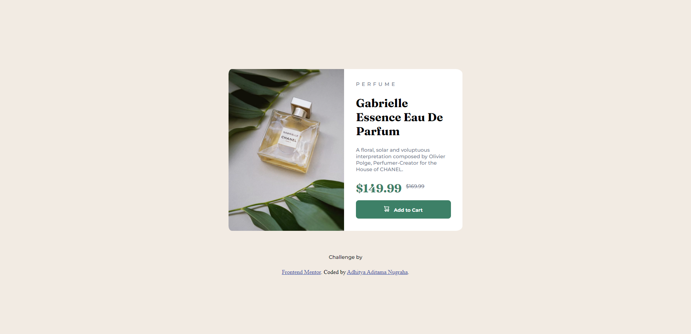
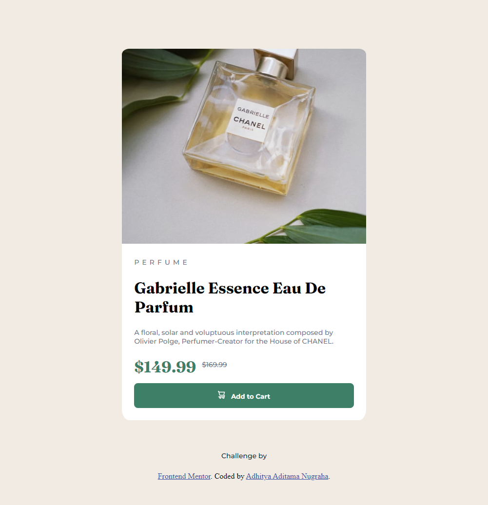

# Frontend Mentor - Product preview card component solution

This is a solution to the [Product preview card component challenge on Frontend Mentor](https://www.frontendmentor.io/challenges/product-preview-card-component-GO7UmttRfa). Frontend Mentor challenges help you improve your coding skills by building realistic projects.

## Table of contents

- [Overview](#overview)
  - [The challenge](#the-challenge)
  - [Screenshot](#screenshot)
  - [Links](#links)
- [My process](#my-process)
  - [Built with](#built-with)
  - [What I learned](#what-i-learned)
  - [Continued development](#continued-development)
  - [Useful resources](#useful-resources)
- [Author](#author)
- [Acknowledgments](#acknowledgments)

## Overview

### The challenge

Users should be able to:

- View the optimal layout depending on their device's screen size
- See hover and focus states for interactive elements

### Screenshot

### Links

- Solution URL: [Add solution URL here](https://your-solution-url.com)
- Live Site URL: [Add live site URL here](https://your-live-site-url.com)

## My process

### Built with

- Semantic HTML5 markup
- CSS custom properties
- Flexbox

### What I learned

From learning to create a product preview card component using HTML and CSS, 🤓 I learned about:

1️⃣ How to use HTML elements such as div, img, and span to create the basic structure of a component. 🧑‍💻
2️⃣ How to use CSS to style the appearance such as setting colors, fonts, and text sizes. 🌈
3️⃣ The use of display and flexbox properties to layout the component. 🧑‍💼

💪 Overall, I feel more confident in creating perfect HTML and CSS components after learning about this!

### Continued development

In future projects, I want to focus on:

1️⃣ Refining my skills in using CSS grid and layout techniques. 🧑‍💼
2️⃣ Experimenting with advanced CSS effects such as animations and transitions. 🎨
3️⃣ Improving my understanding of responsive design principles. 📱

### Useful resources

- [W3 Schools CSS Reference](https://www.w3schools.com/cssref/index.php) - The w3schools website helps me make websites responsive by providing easy-to-understand tutorials and examples that can be used as references. I can also use the available trial console on the site to try out my HTML and CSS code and see the results live.

## Author

- Github - [aaditamanugraha](https://github.com/aaditamanugraha)
- Frontend Mentor - [@aaditamanugraha](https://www.frontendmentor.io/profile/aaditamanugraha)
- LinkedIn - [Adhitya Aditama Nugraha](https://www.linkedin.com/in/aaditamanugraha/)

## Acknowledgments

I want to give credit to the (https://www.frontendmentor.io) for providing many challenges for front end developer practice and helping create portfolios for free. They have an interesting and challenging collection of designs that I can use to learn and improve my skills in creating responsive and modern websites.
